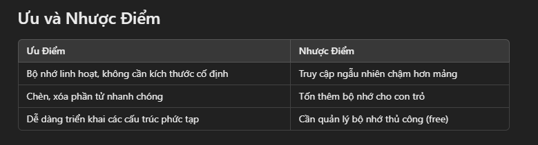

Giới Thiệu

- Linked List (danh sách liên kết) là một cấu trúc dữ liệu tuyến tính, trong đó các phần tử được liên kết với nhau bằng cách sử dụng các con trỏ. Không giống như mảng, các phần tử trong danh sách liên kết không nằm liên tiếp trong bộ nhớ, cho phép chèn và xóa phần tử hiệu quả hơn.
  Các Loại Linked List
- Singly Linked List: Danh sách liên kết đơn, mỗi node chỉ chứa con trỏ trỏ đến node kế tiếp.
- Doubly Linked List: Danh sách liên kết đôi, mỗi node chứa hai con trỏ: một trỏ đến node trước và một trỏ đến node sau.
- Circular Linked List: Danh sách liên kết vòng, node cuối cùng trỏ về node đầu tiên.

Ứng Dụng

- Singly Linked List: Quản lý bộ nhớ động, undo/redo.
- Doubly Linked List: Triển khai trình duyệt web (chuyển tiếp/quay lại).
- Circular Linked List: Bộ đệm vòng, vòng lặp các thành phần trong ứng dụng.
