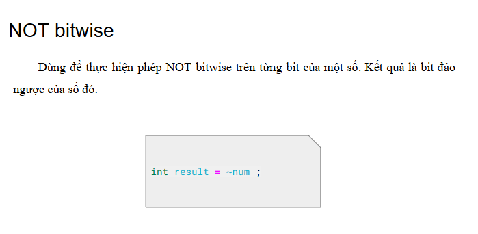

Bitmask là một kỹ thuật sử dụng các bit để lưu trữ và thao tác với các cờ (flags) hoặc trạng thái. Có thể sử dụng bitmask để đặt, xóa và kiểm tra trạng thái của các bit cụ thể trong một từ (word).
Bitmask thường được sử dụng để tối ưu hóa bộ nhớ, thực hiện các phép toán logic trên một cụm bit, và quản lý các trạng thái, quyền truy cập, hoặc các thuộc tính khác của một đối tượng.

