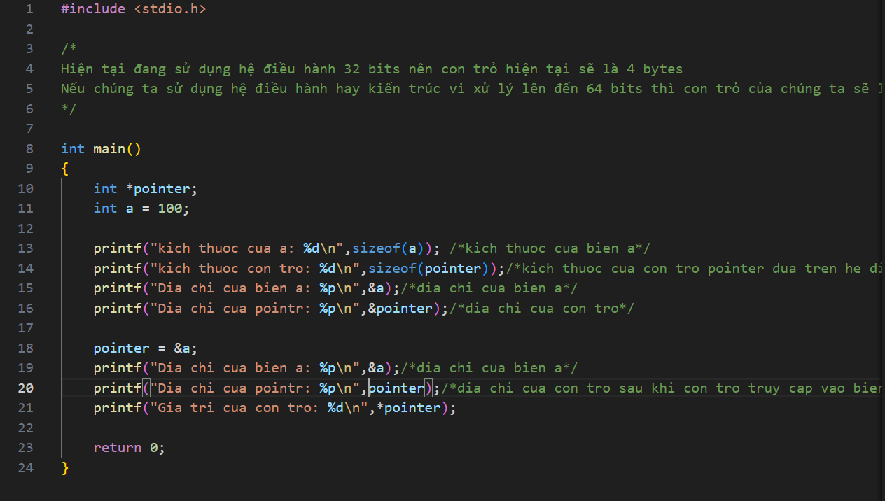

Trong ngôn ngữ lập trình C, con trỏ (pointer) là một biến chứa địa chỉ bộ nhớ của một đối tượng khác(biến, mảng, hàm). Việc sử dụng con troe giúp chúng ta thực hiện các thao tác trên bộ nhớ một cách linh hoạt.
Kích thước con trỏ phụ thuộc vào kiến trúc máy tính và trình biên dịch hoặc là kiến trúc của vi xử lý.

NHỮNG CON TRỎ PHỔ BIẾN THƯỜNG GẶP:

1. Void Pointer - Cách sử dụng: cấp phát một lần để trỏ vào bất kỳ kiểu dữ liệu nào trong xuyên suốt chưng trình
   - thay vì phải khai báo nhiều con trỏ => GIÚP TIẾT KIỆM BỘ NHỚ
   - Lưu ý: tại 1 thời điểm chỉ thao tác được với duy nhất 1 biến.
   - Có thể khai báo mảng với on trỏ void.
   - Con trỏ kiểu void thường dùng để trỏ tới bất kỳ địa chỉ nào mà không cần biết tới kiểu dữ liệu của gía trị tại địa chỉ đó
     ví dụ: xem file VoidPointer.c
2. Function Pointer

   - Pointer to function (con trỏ hàm) là một biến mà giữ địa chỉ của một hàm. Có nghĩa là, nó trỏ đến vùng nhớ trong bộ nhớ chứa mã máy của hàm được định nghĩa trong chương trình.
   - Trong ngôn ngữ lập trình C, con trỏ hàm cho phép bạn truyền một hàm như là một đối số cho một hàm khác, lưu trữ địa chỉ của hàm trong một cấu trúc dữ liệu, hoặc thậm chí truyền hàm như một giá trị trả về từ một hàm khác.

   ví dụ: FunctionPointer_1.c
   ví dụ: FunctionPointer_2.c
   ví dụ: FunctionPointer_3.c

3. Pointer to constant (con trỏ tới một hằng số)
   - Con trỏ tới một hằng là cách định nghĩa một con trỏ mà giá trị tại địa chỉ mà con trỏ trỏ tới không thể thay đổi được giá trị nhưng địa chỉ thì lại có thể thay đổi.
     ví dụ: PointerToConst.c
4. Constant Pointer (Hằng con trỏ)
   - Một hằng con trỏ là cách định nghĩa một con trỏ mà địa chỉ mà con trỏ trỏ tới không thể thay đổi được nhưng giá trị tại địa chỉ đó thì lại có thể thay đổi.
     ví dụ: ConstantPointer.c
5. NULL Pointer
   - Null Pointer là một con trỏ không trỏ đến bất kỳ đối tượng hoặc vùng nhớ cụ thể nào. Trong ngôn ngữ lập trình C, một con trỏ có thể được gán giá trị NULL để biểu diễn trạng thái null.
   - Sử dụng null pointer thường hữu ích để kiểm tra xem một con trỏ đã được khởi tạo và có trỏ đến một vùng nhớ hợp lệ chưa. Tránh dereferencing (sử dụng giá trị mà con trỏ trỏ đến) một null pointer là quan trọng để tránh lỗi chương trình.
     ví dụ: NULLPointer.c
6. Pointer to Pointer (con trỏ trỏ con trỏ, con trỏ cấp 1,2,....)
   - Con trỏ đến con trỏ (Pointer to Pointer) là một kiểu dữ liệu trong ngôn ngữ lập trình cho phép bạn lưu trữ địa chỉ của một con trỏ. Con trỏ đến con trỏ cung cấp một cấp bậc trỏ mới, cho phép bạn thay đổi giá trị của con trỏ gốc. Cấp bậc này có thể hữu ích trong nhiều tình huống, đặc biệt là khi bạn làm việc với các hàm cần thay đổi giá trị của con trỏ.
     ví dụ: PointerToPointer.c
