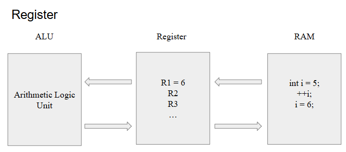

            EXTERN - STATIC - VOLATILE -REGISTER

1. Extern

   - Khái niệm Extern trong ngôn ngữ lập trình C được sử dụng để thông báo rằng một biến hoặc hàm đã được khai báo ở một nơi khác trong chương trình hoặc trong một file nguồn khác. Điều này giúp chương trình hiểu rằng biến hoặc hàm đã được định nghĩa và sẽ được sử dụng từ một vị trí khác, giúp quản lý sự liên kết giữa các phần khác nhau của chương trình hoặc giữa các file nguồn.
   - ứng dụng: Báo cho compiler biết rằng biến đó được khai báo ở một file nguồn khác.

2.1 Static local variables

- Phạm vi truy cập (Scope): Chỉ trong hàm hoặc khối mà nó được khai báo.
- Thời gian sống (Lifetime): Tồn tại trong toàn bộ thời gian chạy chương trình.
- Tính chất khởi tạo: Giá trị được giữ lại giữa các lần gọi hàm.
- Truy cập từ bên ngoài file: Không thể truy cập.
- Ứng dụng : Lưu trạng thái hoặc đếm số lần hàm được gọi.

  2.2 Static global variables

- Phạm vi truy cập (Scope): Toàn bộ file nơi nó được khai báo (file scope).
- Thời gian sống (Lifetime): Tồn tại trong toàn bộ thời gian chạy chương trình.
- Tính chất khởi tạo: Giá trị giữ nguyên suốt chương trình (vì không có khái niệm "gọi lại").
- Truy cập từ bên ngoài file: Không thể truy cập từ file khác, trừ khi dùng extern.
- Ứng dụng: dùng để thiết kế các file thư viện, Tạo biến toàn cục nhưng giới hạn truy cập trong file.

3. Volatile

- Bỏ qua tối ưu hóa của trình biên dịch: Trình biên dịch thường tối ưu mã bằng cách lưu giá trị của biến vào thanh ghi và sử dụng giá trị trong thanh ghi thay vì đọc lại từ bộ nhớ.Với biến được khai báo volatile, trình biên dịch luôn đọc giá trị trực tiếp từ bộ nhớ, vì giá trị của biến có thể thay đổi do tác động bên ngoài mà trình biên dịch không kiểm soát được.

- Không cho phép bỏ qua các thay đổi từ bên ngoài:
  Giá trị của biến có thể thay đổi bởi:
  Phần cứng (Hardware): Như một thanh ghi I/O.
  Hệ thống đa luồng: Khi một luồng khác cập nhật giá trị.
  Interrupt (ngắt): Một xử lý ngắt có thể thay đổi giá trị biến.

- Tương thích với hầu hết các kiểu dữ liệu:
  volatile có thể áp dụng cho các kiểu dữ liệu cơ bản (int, char, float,...) hoặc phức tạp (mảng, con trỏ, struct,...).

- Ứng dụng:
  Làm việc với thanh ghi phần cứng (I/O registers)
  Xử lý ngắt (Interrupt Handlers)
  Lập trình đa luồng (Multithreading)
  Tránh lỗi tối ưu hóa trong vòng lặp chờ

4. Register
   Trong ngôn ngữ lập trình C, từ khóa register được sử dụng để chỉ ra ý muốn của lập trình viên rằng một biến được sử dụng thường xuyên và có thể được lưu trữ trong một thanh ghi máy tính, chứ không phải trong bộ nhớ RAM. Việc này nhằm tăng tốc độ truy cập. Tuy nhiên, lưu ý rằng việc sử dụng register chỉ là một đề xuất cho trình biên dịch và không đảm bảo rằng biến sẽ được lưu trữ trong thanh ghi. Trong thực tế, trình biên dịch có thể quyết định không tuân thủ lời đề xuất này.
   
