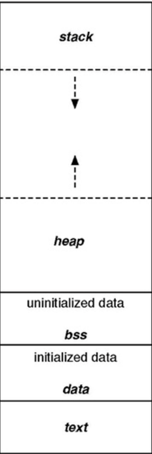
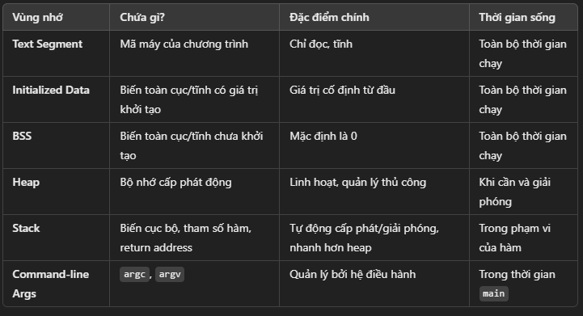

                Memory layout

Chương trình main.exe ( trên window), main.hex ( nạp vào vi điều khiển) được lưu ở bộ nhớ SSD hoặc FLASH. Khi nhấn run chương trình trên window ( cấp nguồn cho vi điều khiển) thì những chương trình này sẽ được copy vào bộ nhớ RAM để thực thi.

Text segment (Code segment)

- Mã máy: chứa tập hợp các lệnh thực thi.
- Quyền truy cập: Text Segment thường có quyền đọc và thực thi, nhưng không có quyền ghi.
- Lưu hằng số toàn cục (const), chuỗi hằng - string literal (Clang – macOS, windows - minGW)
- Tất cả các biến lưu ở phần vùng Text đều không thể thay đổi giá trị mà chỉ được đọc.

Data segment

- Initialized Data Segment (Dữ liệu Đã Khởi Tạo):
- Chứa các biến toàn cục được khởi tạo với giá trị khác 0.
- Chứa các biến static (global + local) được khởi tạo với giá trị khác 0.
- Quyền truy cập là đọc và ghi, tức là có thể đọc và thay đổi giá trị của biến .
- Tất cả các biến sẽ được thu hồi sau khi chương trình kết thúc.

Bss segment

- Uninitialized Data Segment (Dữ liệu Chưa Khởi Tạo):
- Chứa các biến toàn cục khởi tạo với giá trị bằng 0 hoặc không gán giá trị.
- Chứa các biến static với giá trị khởi tạo bằng 0 hoặc không gán giá trị.
- Quyền truy cập là đọc và ghi, tức là có thể đọc và thay đổi giá trị của biến .
- Tất cả các biến sẽ được thu hồi sau khi chương trình kết thúc.

Stack

- Chứa các biến cục bộ (trừ static cục bộ), tham số truyền vào.
- Hằng số cục bộ, có thể thay đổi thông qua con trỏ.
- Quyền truy cập: đọc và ghi, nghĩa là có thể đọc và thay đổi giá trị của biến trong suốt thời gian chương trình chạy.
- Sau khi ra khỏi hàm, sẽ thu hồi vùng nhớ.

Heap(Cấp phát động)

- Heap được sử dụng để cấp phát bộ nhớ động trong quá trình thực thi của chương trình.
- Điều này cho phép chương trình tạo ra và giải phóng bộ nhớ theo nhu cầu, thích ứng với sự biến đổi của dữ liệu trong quá trình chạy.
- Các hàm như malloc(), calloc(), realloc(), và free() được sử dụng để cấp phát và giải phóng bộ nhớ trên heap.
- Heap - malloc() => (Tham số truyền vào: kích thước mong muốn ( byte), Giá trị trả về: con trỏ void)

Bảng tóm tắt:

