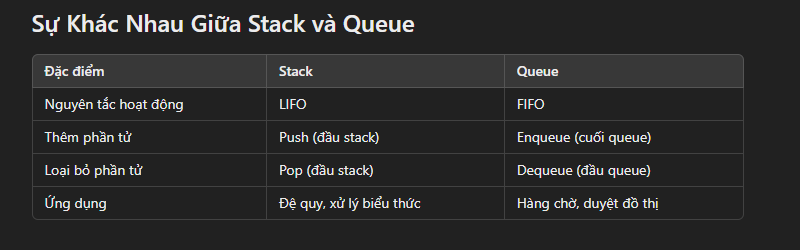

Stack
Định nghĩa
Stack (ngăn xếp) là cấu trúc dữ liệu hoạt động theo nguyên tắc LIFO (Last In, First Out), nghĩa là phần tử được thêm vào sau cùng sẽ được lấy ra đầu tiên.
Các thao tác cơ bản

- Push: Thêm một phần tử vào đỉnh của stack.
- Pop: Loại bỏ và trả về phần tử ở đỉnh của stack.
- Peek/Top: Xem phần tử ở đỉnh của stack mà không loại bỏ.
- isEmpty: Kiểm tra xem stack có rỗng không.
- isFull (nếu sử dụng mảng): Kiểm tra xem stack đã đầy chưa.

Ứng dụng của Stack

- Đệ quy
- Duyệt biểu thức toán học (chuyển đổi và tính giá trị biểu thức hậu tố, tiền tố)
- Quản lý lời gọi hàm (call stack)

Queue
Định nghĩa
Queue (hàng đợi) là cấu trúc dữ liệu hoạt động theo nguyên tắc FIFO (First In, First Out), nghĩa là phần tử được thêm vào trước sẽ được lấy ra trước.

Các thao tác cơ bản

- Enqueue: Thêm một phần tử vào cuối hàng đợi.
- Dequeue: Loại bỏ và trả về phần tử ở đầu hàng đợi.
- Peek/Front: Xem phần tử ở đầu hàng đợi mà không loại bỏ.
- isEmpty: Kiểm tra xem hàng đợi có rỗng không.
- isFull (nếu sử dụng mảng): Kiểm tra xem hàng đợi đã đầy chưa.

Ứng dụng của Queue

- Quản lý tài nguyên (CPU scheduling, xử lý in ấn)
- Thuật toán duyệt đồ thị (BFS - Breadth-First Search)
- Hệ thống hàng chờ (xử lý yêu cầu, tin nhắn)

